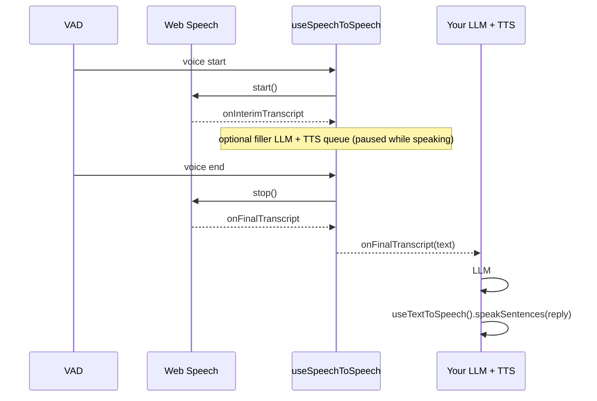

# speech-to-speech

TypeScript utilities for speech-to-text (STT) and text-to-speech (TTS) in the browser. Ships ESM/CJS bundles with full TypeScript declarations.

**Features:**

- 🎤 **STT**: Browser Web Speech with silent session rotation and live interim captions
- 🗣️ **Speech-to-speech**: VAD-gated hooks (`initializeSpeechToSpeech` / `useSpeechToSpeech`) with optional filler words; you own the agent LLM
- 🔊 **TTS**: Piper neural TTS with automatic model downloading
- ⚡ **WASM caching**: Browser Cache API for Piper / ONNX assets
- 🎵 **Shared audio queue**: One app-wide player via `useSharedAudioPlayer()`
- 🧩 **Consumer hooks**: `initialize*` + `use*` pattern (framework-agnostic; works in React/Vue/vanilla)
- 📦 **Vite plugin**: `speech-to-speech/vite` serves `/ort/` and `/vad/` in dev and production builds

## Prerequisites

| Requirement             | `useSpeechToText`                        | `useTextToSpeech`                           | `useSpeechToSpeech` (VAD always on)                |
| ----------------------- | ---------------------------------------- | ------------------------------------------- | -------------------------------------------------- |
| **Browser**             | Chrome, Edge, or Safari (Web Speech API) | Modern browser + Web Audio                  | Same as STT + TTS                                  |
| **`onnxruntime-web`**   | Not required                             | **Required** (peer dependency)              | **Required**                                       |
| **COOP / COEP headers** | Not required                             | Recommended for WASM                        | **Required** (`SharedArrayBuffer` / ORT WASM)      |
| **Microphone**          | User permission                          | —                                           | User permission                                    |
| **HTTPS or localhost**  | Recommended for mic                      | —                                           | **Required** for `getUserMedia`                    |
| **Vite (optional)**     | —                                        | Use `speech-to-speech/vite` if you use Vite | **Strongly recommended** (serves ORT + VAD assets) |

Install:

```bash
npm install speech-to-speech onnxruntime-web
```

Peer dependencies (install in your app):

- **`onnxruntime-web`** — Piper TTS and VAD inference in the browser
- **`vite`** (optional) — only if you import `speech-to-speech/vite`

`@ricky0123/vad-web` is bundled as a dependency of `speech-to-speech` for neural VAD; the Vite plugin copies its `dist` assets to `/vad/` at dev/build time. You do **not** need to vendor VAD source into your repo.

**Before first run (Vite apps):**

1. Add `speechAssetsPlugin` and COOP/COEP headers (see [Vite configuration](#vite-configuration-required)).
2. Call `initializeTextToSpeech` or `initializeSpeechToSpeech` early (loads Piper + VAD models).
3. For STS, call `await initializeSpeechToSpeech(...)` then `await agent.startConversation()` so the VAD model and mic are ready when the user starts.

See `sample-consumer/` in this repository for a full demo (STT, TTS, and STS tabs).

## Quick Start

### Installation

Same as [prerequisites](#prerequisites) — `npm install speech-to-speech onnxruntime-web`.

### Basic Usage (consumer hooks)

Load assets early, then wire callbacks when the user is ready to interact:

```typescript
import {
  initializeSpeechToText,
  useSpeechToText,
  initializeTextToSpeech,
  useTextToSpeech,
  useSharedAudioPlayer,
} from "speech-to-speech";

// --- Speech-to-text only ---
initializeSpeechToText({
  continueOnSilence: true, // final transcript when you call stopTranscript()
  silenceThresholdMs: 1500, // used when continueOnSilence is false
});

const stt = useSpeechToText({
  onLog: (message, level) => console.log(`[STT ${level}] ${message}`),
  onInterimTranscript: (text) => console.log("interim:", text),
  onFinalTranscript: (text) => console.log("final:", text),
});

stt.startTranscript();
// stt.stopTranscript();
// stt.destroyTranscription();

// --- Text-to-speech only (preload on app load) ---
await initializeTextToSpeech({
  voiceId: "en_US-hfc_female-medium",
});

const tts = useTextToSpeech();
await tts.speak("Hello world!");

// --- Shared audio queue (optional; used by default for TTS) ---
const player = useSharedAudioPlayer();
player.configure({ autoPlay: true });
```

**Speech-to-speech (VAD-gated voice UI):**

STS **always** uses neural VAD (`@ricky0123/vad-web`). The consumer owns the main LLM turn; the SDK handles mic gating, Web Speech per utterance, optional **filler words**, and TTS playback helpers.

- **VAD voice start** → Web Speech `start()` for that utterance; filler timers begin.
- **VAD voice end** → Web Speech `stop()` → `onFinalTranscript` (one per utterance).
- Web Speech runs with **`continueOnSilence: true` internally** (silent browser restarts; no app final until VAD ends the utterance).
- **`heuristics`** → LLM used only for short/long **fillers** (not the agent reply).
- **`bargeIn: true`** (default) → VAD speech during TTS clears the queue and starts a new utterance.

```typescript
import {
  initializeSpeechToSpeech,
  useSpeechToSpeech,
  useTextToSpeech,
  useSharedAudioPlayer,
} from "speech-to-speech";

const player = useSharedAudioPlayer();
const history: { role: "user" | "assistant"; content: string }[] = [];

await initializeSpeechToSpeech({
  stt: {
    language: "en-US",
    preserveTranscriptOnStart: false,
    vad: {
      minSpeechMs: 400,
      minSilenceMs: 1200,
      assetPaths: {
        baseAssetPath: "/vad/",
        onnxWASMBasePath: "/ort/",
      },
    },
    heuristics: {
      llmEndpoint: "https://api.example.com/v1/chat/completions",
      apiKey: process.env.LLM_KEY!,
      model: "deepseek-chat",
      shortFillerWords: true,
      longFillerWords: false,
      shortFillerDelayMs: 5000,
      longFillerDelayMs: 10000,
    },
  },
  tts: { voiceId: "en_US-hfc_female-medium", autoPlay: true },
  bargeIn: true,
});

const tts = useTextToSpeech({ player });

const agent = useSpeechToSpeech({
  getConversationHistory: () => history,
  onLog: (msg, level) => console.log(`[STS ${level}]`, msg),
  onInterimTranscript: (text) => setLiveCaption(text),
  onFillerGenerated: (type, text) => console.log(`filler (${type}):`, text),
  onFinalTranscript: async (text) => {
    history.push({ role: "user", content: text });
    const reply = await callYourLlm(history); // your API
    history.push({ role: "assistant", content: reply });
    await tts.speakSentences(reply);
  },
  onAgentStateChange: (state) => {
    // idle | listening | speaking
    setStatus(state);
  },
});

await agent.startConversation();
// agent.stopConversation();
// agent.destroy();
```

> **Note:** Import from the main package only for app code. Class-based APIs (`STTLogic`, `TTSLogic`, etc.) are internal building blocks under `speech-to-speech/stt` and `speech-to-speech/tts` — not part of the supported consumer surface.

## Consumer hooks API

The **main export** (`speech-to-speech`) is the only supported integration path for applications. Use `initialize*` to preload configuration, then `use*` to wire callbacks and receive controls — framework-agnostic (vanilla, React, Vue, etc.).

| Phase                   | Speech-to-text                           | Text-to-speech                                    | Speech-to-speech                                         |
| ----------------------- | ---------------------------------------- | ------------------------------------------------- | -------------------------------------------------------- |
| **Configure / preload** | `initializeSpeechToText(config)`         | `await initializeTextToSpeech(config)`            | `await initializeSpeechToSpeech({ stt, tts, bargeIn? })` |
| **Wire UI**             | `useSpeechToText(handlers)`              | `useTextToSpeech({ player? })`                    | `useSpeechToSpeech(handlers)`                            |
| **Run**                 | `startTranscript()` / `stopTranscript()` | `speak()` / `speakSentences()` / `stopSpeaking()` | `await startConversation()` / `stopConversation()`       |
| **Cleanup**             | `destroyTranscription()`                 | —                                                 | `destroy()`                                              |

**Prefetch TTS WASM** (optional, before `initializeTextToSpeech`):

```typescript
import { prefetchTextToSpeechAssets } from "speech-to-speech";

await prefetchTextToSpeechAssets({
  voiceId: "en_US-hfc_female-medium",
  wasmPaths: { piperData: "...", piperWasm: "..." },
});
```

**Shared audio player** (singleton used by default for TTS/STS):

```typescript
import { useSharedAudioPlayer } from "speech-to-speech";

const player = useSharedAudioPlayer();
player.configure({ autoPlay: true, volume: 1 });
player.stopAndClear();
```

### `initializeSpeechToText` / `useSpeechToText`

| Option                                  | Applies to        | Description                                                                                                                     |
| --------------------------------------- | ----------------- | ------------------------------------------------------------------------------------------------------------------------------- |
| `continueOnSilence: true` (default)     | **STT hook only** | Web Speech keeps listening across silent browser restarts. **`onFinalTranscript` fires once** when you call `stopTranscript()`. |
| `continueOnSilence: false`              | **STT hook only** | After `silenceThresholdMs` of no speech, **`onFinalTranscript` fires** and listening stops.                                     |
| `silenceThresholdMs`                    | STT hook only     | Used when `continueOnSilence` is `false` (default `1500`).                                                                      |
| `language`, `preserveTranscriptOnStart` | STT + STS         | BCP-47 tag and transcript preservation on `start`.                                                                              |

STS does **not** expose `continueOnSilence` — it is always `true` inside the wrapper; utterance boundaries come from **VAD**, not Web Speech silence.

### `SpeechToSpeechSttConfig`

| Field        | Description                                                                                                                                    |
| ------------ | ---------------------------------------------------------------------------------------------------------------------------------------------- |
| `vad`        | Neural VAD tuning (`minSpeechMs`, `minSilenceMs`, `assetPaths` → `/vad/` + `/ort/`). Always on for STS.                                        |
| `heuristics` | Filler LLM only: `llmEndpoint`, `apiKey`, `shortFillerWords`, `longFillerWords`, delays, `fillerRequestTimeoutMs`, prompts, `maxHistoryTurns`. |
| `language`   | Web Speech BCP-47 tag (default `en-US`).                                                                                                       |

### `useSpeechToSpeech` handlers

| Handler                  | Description                                                                                                       |
| ------------------------ | ----------------------------------------------------------------------------------------------------------------- |
| `onInterimTranscript`    | Live caption for the current utterance.                                                                           |
| `onFinalTranscript`      | User turn complete (VAD speech end). **You call your LLM and TTS here.**                                          |
| `onFillerGenerated`      | Short/long filler text when ready (parallel to final; in-flight fillers are dropped if the utterance ends first). |
| `getConversationHistory` | Optional; preferred source for filler LLM context (else SDK keeps last N turns).                                  |
| `onAgentStateChange`     | `idle` \| `listening` \| `speaking` (speaking = shared player playing).                                           |
| `onSpeakingChange`       | VAD mic speech start/stop.                                                                                        |

Controls: `startConversation()`, `stopConversation()`, `clearTranscription()`, `setConversationHistory()`, `appendConversationTurn()`, `destroy()`.

`stopConversation()` stops VAD/STT, cancels pending fillers, and clears TTS playback.

### Deprecated

`createSpeechService()` remains exported for legacy apps; do not use it in new code.

## Vite Configuration (Required)

For Vite-based projects, add this configuration to `vite.config.ts`. The plugin serves ONNX Runtime files at **`/ort/*`** and VAD worklet/model files at **`/vad/*`** (from `onnxruntime-web` and `@ricky0123/vad-web` in `node_modules`). It can also copy those folders into your build output when `copyForProduction: true`.

**Do not copy plugin source into your app** — import from the package:

### Basic Configuration

```typescript
import { defineConfig } from "vite";
import { speechAssetsPlugin } from "speech-to-speech/vite";

export default defineConfig({
  plugins: [speechAssetsPlugin({ copyForProduction: true })],

  server: {
    port: 3000,
    headers: {
      // Required for SharedArrayBuffer (WASM multi-threading)
      "Cross-Origin-Opener-Policy": "same-origin",
      "Cross-Origin-Embedder-Policy": "require-corp",
    },
    fs: {
      allow: [".."],
    },
  },
  optimizeDeps: {
    // Force pre-bundling for dev server compatibility
    include: ["onnxruntime-web", "@realtimex/piper-tts-web"],
    esbuildOptions: {
      target: "esnext",
    },
  },
  worker: {
    format: "es",
  },
  build: {
    target: "esnext",
  },
  assetsInclude: ["**/*.wasm", "**/*.onnx"],
});
```

### Advanced Configuration (legacy manual ORT middleware)

Prefer `speechAssetsPlugin` above. If you still have issues with ONNX paths, you can use a custom middleware (ORT only — it does not serve `/vad/`):

```typescript
import { defineConfig } from "vite";
import path from "path";
import fs from "fs";

// Custom plugin to serve ONNX runtime files from node_modules
function serveOrtFiles() {
  return {
    name: "serve-ort-files",
    configureServer(server: any) {
      server.middlewares.use("/ort", (req: any, res: any, next: any) => {
        const urlPath = req.url.split("?")[0];
        const filePath = path.join(
          __dirname,
          "node_modules/onnxruntime-web/dist",
          urlPath,
        );

        if (fs.existsSync(filePath)) {
          const ext = path.extname(filePath);
          const contentType =
            ext === ".mjs" || ext === ".js"
              ? "application/javascript"
              : ext === ".wasm"
                ? "application/wasm"
                : "application/octet-stream";

          res.setHeader("Content-Type", contentType);
          res.setHeader("Cross-Origin-Opener-Policy", "same-origin");
          res.setHeader("Cross-Origin-Embedder-Policy", "require-corp");
          fs.createReadStream(filePath).pipe(res);
        } else {
          next();
        }
      });
    },
  };
}

// Custom plugin to patch CDN URLs in piper-tts-web
function patchPiperTtsWeb() {
  return {
    name: "patch-piper-tts-web",
    transform(code: string, id: string) {
      if (id.includes("@mintplex-labs/piper-tts-web")) {
        return code.replace(
          /https:\/\/cdnjs\.cloudflare\.com\/ajax\/libs\/onnxruntime-web\/1\.18\.0\//g,
          "/ort/",
        );
      }
      return code;
    },
  };
}

export default defineConfig({
  plugins: [serveOrtFiles(), patchPiperTtsWeb()],
  resolve: {
    alias: {
      "onnxruntime-web/wasm": path.resolve(
        __dirname,
        "node_modules/onnxruntime-web/dist/ort.webgpu.mjs",
      ),
    },
  },
  optimizeDeps: {
    exclude: ["@mintplex-labs/piper-tts-web"],
    include: ["onnxruntime-web"],
    esbuildOptions: {
      define: { global: "globalThis" },
    },
  },
  server: {
    headers: {
      "Cross-Origin-Opener-Policy": "same-origin",
      "Cross-Origin-Embedder-Policy": "require-corp",
    },
    fs: { allow: [".."] },
  },
  build: {
    assetsInlineLimit: 0,
  },
});
```

## Next.js Configuration (Required)

For Next.js projects, you need additional configuration since this library uses browser-only APIs.

### 1. Configure Headers in `next.config.js`

```javascript
/** @type {import('next').NextConfig} */
const nextConfig = {
  async headers() {
    return [
      {
        source: "/(.*)",
        headers: [
          { key: "Cross-Origin-Opener-Policy", value: "same-origin" },
          { key: "Cross-Origin-Embedder-Policy", value: "require-corp" },
        ],
      },
    ];
  },
  webpack: (config, { isServer }) => {
    if (!isServer) {
      config.resolve.fallback = {
        ...config.resolve.fallback,
        fs: false,
        path: false,
      };
    }
    return config;
  },
};

module.exports = nextConfig;
```

### 2. Client-Side Only Usage

Since this library uses browser APIs, you **must** ensure it only runs on the client:

```typescript
"use client";

import { useEffect, useState, useRef } from "react";

export default function SpeechComponent() {
  const [isReady, setIsReady] = useState(false);
  const ttsRef = useRef<ReturnType<
    typeof import("speech-to-speech").useTextToSpeech
  > | null>(null);

  useEffect(() => {
    async function initTTS() {
      const {
        initializeTextToSpeech,
        useTextToSpeech,
        useSharedAudioPlayer,
      } = await import("speech-to-speech");

      const player = useSharedAudioPlayer();
      player.configure({ autoPlay: true });

      await initializeTextToSpeech({
        voiceId: "en_US-hfc_female-medium",
      });
      ttsRef.current = useTextToSpeech({ player });
      setIsReady(true);
    }

    initTTS();
  }, []);

  const speak = async (text: string) => {
    if (!ttsRef.current?.isReady()) return;
    await ttsRef.current.speak(text);
  };

  return (
    <button onClick={() => speak("Hello!")} disabled={!isReady}>
      {isReady ? "Speak" : "Loading..."}
    </button>
  );
}
```

## Exports

**Applications should import only from the main entry:**

```typescript
import {
  // STT
  initializeSpeechToText,
  useSpeechToText,
  // TTS
  initializeTextToSpeech,
  useTextToSpeech,
  prefetchTextToSpeechAssets,
  // STS
  initializeSpeechToSpeech,
  useSpeechToSpeech,
  // Audio
  useSharedAudioPlayer,
  createSharedAudioPlayer,
  // Utils
  getCompatibilityInfo,
} from "speech-to-speech";

// Vite dev/build plugin (vite.config.ts only — Node)
import { speechAssetsPlugin } from "speech-to-speech/vite";
```

Optional utilities (not hooks): `cleanTextForTTS` from `speech-to-speech/tts`.  
`createSpeechService` is deprecated on the main export.

The `speech-to-speech/stt` and `speech-to-speech/tts` subpaths expose low-level classes used internally by the hooks; they are not documented for app integration.

## API Reference (hooks)

### Speech-to-text controls (`useSpeechToText`)

Returned by `useSpeechToText(handlers)` after `initializeSpeechToText(config)`:

| Method                   | Description                                                                                              |
| ------------------------ | -------------------------------------------------------------------------------------------------------- |
| `startTranscript()`      | Start Web Speech listening.                                                                              |
| `stopTranscript()`       | Stop listening; returns full transcript string; fires `onFinalTranscript` per `continueOnSilence` rules. |
| `getTranscript()`        | Live transcript without stopping.                                                                        |
| `clearTranscription()`   | Clear accumulated text.                                                                                  |
| `destroyTranscription()` | Tear down recognition.                                                                                   |
| `isListening()`          | Whether recognition is active.                                                                           |

**Handlers:** `onLog`, `onInterimTranscript`, `onFinalTranscript`, `onSpeakingChange` (Web Speech heuristic), `onWordsUpdate`.

**Example — manual stop (`continueOnSilence: true`):**

```typescript
initializeSpeechToText({ continueOnSilence: true });

const stt = useSpeechToText({
  onInterimTranscript: (live) => (captionEl.textContent = live),
  onFinalTranscript: (final) => saveNote(final),
});

stt.startTranscript();
// user speaks…
stt.stopTranscript();
```

**Example — silence-triggered final (`continueOnSilence: false`):**

```typescript
initializeSpeechToText({
  continueOnSilence: false,
  silenceThresholdMs: 1500,
});

const stt = useSpeechToText({
  onFinalTranscript: (final) => sendToBackend(final),
});

stt.startTranscript();
// final fires automatically after 1.5s silence; call startTranscript() again for next turn
```

### Text-to-speech controls (`useTextToSpeech`)

After `await initializeTextToSpeech({ voiceId, wasmPaths?, autoPlay?, ... })`:

| Method                 | Description                                              |
| ---------------------- | -------------------------------------------------------- |
| `speak(text)`          | Synthesize and enqueue one string.                       |
| `speakSentences(text)` | Split on `.!?;` and enqueue sentences for lower latency. |
| `stopSpeaking()`       | Stop playback and clear queue.                           |
| `isReady()`            | Whether WASM/voice finished loading.                     |

Pass `{ player: useSharedAudioPlayer() }` to share the queue with STS.

### Shared audio player (`useSharedAudioPlayer`)

Singleton queue used by default for TTS/STS fillers and agent speech:

```typescript
const player = useSharedAudioPlayer();
player.configure({ autoPlay: true, volume: 1 });
player.enqueue(audio, sampleRate);
player.stopAndClear();
await player.waitUntilIdle();
player.setPlayingChangeCallback((playing) => {});
```

`createSharedAudioPlayer()` creates a separate queue if needed.

### Speech-to-speech flow



---

## Unified Speech Service (deprecated)

`createSpeechService()` is deprecated in favor of `initializeSpeechToSpeech` / `useSpeechToSpeech` (VAD, agent states, and shared runtime). It remains available for older integrations.

```ts
import { createSpeechService } from "speech-to-speech";

const service = createSpeechService();

// 1. Set up STT
service.initializeSTT({
  onTranscript: (text) => console.log("Final:", text),
  onInterimTranscript: (text) => setLiveCaption(text), // real-time display
  onWordsUpdate: (words) => console.log("Words so far:", words),
  onStatusChange: (type, data) => {
    if (type === "speaking") setUserSpeaking(data as boolean);
  },
});

// 2. Set up TTS (awaitable)
await service.initializeTTS({ voiceId: "en_US-hfc_female-medium" });

// 3. Start session
service.startListening();
await service.speak("Hello, how can I help you?");

// 4. End session
const transcript = service.stopListening();
service.stopSpeaking();
```

---

## Interim Transcript Streaming

Get real-time partial results while the user is still speaking. `onInterimTranscript` fires on **every** recognition update (both interim and final results) with the full live transcript — including the text committed from prior silent session rotations — so you can render a continuously-growing caption without any gaps when the browser rotates the underlying Web Speech session.

Pass `onInterimTranscript` to `useSpeechToText` or `useSpeechToSpeech`:

```ts
import { initializeSpeechToText, useSpeechToText } from "speech-to-speech";

initializeSpeechToText({ continueOnSilence: true });

const stt = useSpeechToText({
  onFinalTranscript: (finalText) => console.log("Final:", finalText),
  onInterimTranscript: (liveText) => {
    liveCaption.textContent = liveText;
  },
});

stt.startTranscript();
```

---

## TTS Warmup

Prefetch WASM (and optionally the voice model) before the user triggers speech:

```ts
import {
  prefetchTextToSpeechAssets,
  initializeTextToSpeech,
  useTextToSpeech,
} from "speech-to-speech";

await prefetchTextToSpeechAssets({ voiceId: "en_US-hfc_female-medium" });
await initializeTextToSpeech({ voiceId: "en_US-hfc_female-medium" });
const tts = useTextToSpeech();
await tts.speak("Hello"); // faster first playback
```

Low-level API: `prefetchTTSModel(voiceId)` from `speech-to-speech/tts`.

---

## Browser Compatibility Check

Gate your UI before attempting to start STT or TTS:

```ts
import { getCompatibilityInfo } from "speech-to-speech";

const { stt, tts, browser } = getCompatibilityInfo();

if (!stt) {
  showBanner(
    `Speech input is not supported in ${browser}. Please use Chrome or Edge.`,
  );
}
if (!tts) {
  showBanner("Text-to-speech is not supported in this browser.");
}
```

---

## Text Cleanup for TTS

Strip HTML, Markdown, and emoji from LLM responses before passing them to synthesis:

```ts
import { cleanTextForTTS } from "speech-to-speech/tts";

const raw = "**Hello** <b>world</b>! Here's a [link](https://example.com) 🎉";
const spoken = cleanTextForTTS(raw);
// → "Hello world Here's a link"

// Or opt-out of individual steps:
const spoken2 = cleanTextForTTS(raw, { removeEmojis: false });
// → "Hello world Here's a link 🎉"
```

---

## Audio Player Status Callbacks

React to playback state changes without polling:

```ts
import { useSharedAudioPlayer } from "speech-to-speech";

const player = useSharedAudioPlayer();
player.setStatusCallback((status) => {
  console.log("[TTS]", status);
});
player.setPlayingChangeCallback((isPlaying) => {
  setTTSIndicator(isPlaying);
});
```

---

## Available Piper Voices

Voice models are downloaded automatically from CDN on first use (~20-80MB per voice). WASM files (~9MB) are cached automatically and reused across all voices.

| Voice ID                  | Language     | Description                    |
| ------------------------- | ------------ | ------------------------------ |
| `en_US-hfc_female-medium` | English (US) | Female, medium quality         |
| `en_US-lessac-medium`     | English (US) | Neutral, medium quality        |
| `en_US-lessac-low`        | English (US) | Neutral, low quality (smaller) |
| `en_US-lessac-high`       | English (US) | Neutral, high quality (larger) |
| `en_GB-alba-medium`       | English (UK) | British accent                 |
| `de_DE-thorsten-medium`   | German       | German voice                   |
| `fr_FR-upmc-medium`       | French       | French voice                   |

See [Piper Voices](https://rhasspy.github.io/piper-samples/) for the complete list.

## Browser Compatibility

| Feature                  | Chrome | Firefox | Safari | Edge |
| ------------------------ | ------ | ------- | ------ | ---- |
| STT (Speech Recognition) | ✅     | ❌      | ✅     | ✅   |
| TTS (Piper ONNX)         | ✅     | ✅      | ✅     | ✅   |
| Neural VAD (STS)         | ✅     | ✅\*    | ✅\*   | ✅   |
| Web Audio API            | ✅     | ✅      | ✅     | ✅   |

\* Firefox supports VAD/TTS but not Web Speech STT — use Chrome/Edge/Safari for full speech-to-speech.

**Note:** Speech Recognition API requires Chrome, Safari, or Edge. Firefox does not support the Web Speech API.

## Troubleshooting

### TTS Issues

| Issue                   | Solution                                                                                                      |
| ----------------------- | ------------------------------------------------------------------------------------------------------------- |
| "Voice not found"       | Check voice ID spelling. Use `en_US-hfc_female-medium` for testing.                                           |
| Slow first synthesis    | Normal - voice model (~20MB) and WASM files (~9MB) download on first use. Subsequent calls use cached assets. |
| Repeated WASM downloads | Ensure `enableWasmCache: true` (default). Check browser Cache API support.                                    |
| No audio output         | Ensure browser supports Web Audio API. Check volume and audio permissions.                                    |
| CORS errors             | Ensure Vite config has proper COOP/COEP headers (see above).                                                  |

### STT Issues

| Issue                              | Solution                                                                                                                                                   |
| ---------------------------------- | ---------------------------------------------------------------------------------------------------------------------------------------------------------- |
| "Speech Recognition not supported" | Use Chrome, Safari, or Edge. Firefox doesn't support Web Speech API.                                                                                       |
| No transcript                      | Check microphone permissions. Call `startTranscript()` (STT) or `startConversation()` (STS).                                                               |
| Transcript stops (STT hook)        | With `continueOnSilence: true`, Web Speech may rotate silently — use `onInterimTranscript` for live UI; final needs `stopTranscript()`.                    |
| `onFinalTranscript` never fires    | STT: with `continueOnSilence: true` (default), call `stopTranscript()`. With `false`, wait for `silenceThresholdMs`. STS: wait for VAD end of utterance.   |
| Duplicated words in final          | Fixed in v0.1.5. If you still see duplicates, ensure you are on ≥ 0.1.5 — the old `sessionDurationMs` / `interimSaveIntervalMs` timer path no longer runs. |

### VAD / speech-to-speech

| Issue                           | Solution                                                                                          |
| ------------------------------- | ------------------------------------------------------------------------------------------------- |
| Stuck on “Loading VAD…”         | Ensure `speechAssetsPlugin` is registered and `/ort/` + `/vad/` return 200 in Network tab.        |
| 404 on `/ort/*` or `/vad/*`     | Run `npm install onnxruntime-web` in the app; reinstall so the plugin can resolve `node_modules`. |
| Mic never starts                | Call `await startConversation()` (not only `initializeSpeechToSpeech`). Grant mic permission.     |
| STT runs without user speech    | STS always uses VAD — use `useSpeechToText` for always-on Web Speech without neural VAD.          |
| SharedArrayBuffer / COEP errors | Set COOP/COEP headers on dev and preview servers (see Vite config).                               |

### Dev Server Issues (Vite)

| Issue                                           | Solution                                                                                                                |
| ----------------------------------------------- | ----------------------------------------------------------------------------------------------------------------------- |
| "Module externalized for browser compatibility" | Add `optimizeDeps.include` in Vite config (see above).                                                                  |
| WASM loading errors                             | Ensure COOP/COEP headers are set and `speechAssetsPlugin` is enabled.                                                   |
| Type error on `speechAssetsPlugin` in monorepo  | Cast `as PluginOption` if two copies of `vite` exist (`file:..` link). Published npm installs usually do not need this. |
| Works in production but not dev                 | Clear `.vite` cache: `rm -rf node_modules/.vite`                                                                        |

### Next.js Issues

| Issue                     | Solution                                                                    |
| ------------------------- | --------------------------------------------------------------------------- |
| "window is not defined"   | Use dynamic import inside `useEffect` or `next/dynamic` with `ssr: false`.  |
| "document is not defined" | Same as above - library must only run on client side.                       |
| SharedArrayBuffer errors  | Ensure COOP/COEP headers are set in `next.config.js` (see Next.js section). |
| WASM file not loading     | Check browser console for CORS errors. Verify headers config is applied.    |

## Build & Scripts

```bash
npm run build   # Bundle with tsup (ESM/CJS + d.ts) into dist/
npm run lint    # Type-check with tsc --noEmit
npm run clean   # Remove dist/
```

## Built With

- **[ONNX Runtime Web](https://github.com/microsoft/onnxruntime)** - ML inference engine for WASM
- **[Piper TTS](https://github.com/rhasspy/piper)** - Neural text-to-speech by Rhasspy
- **[@realtimex/piper-tts-web](https://github.com/synesthesiam/piper)** - Browser wrapper for Piper
- **[Web Speech API](https://developer.mozilla.org/en-US/docs/Web/API/Web_Speech_API)** - Browser speech recognition
- **[@ricky0123/vad-web](https://github.com/ricky0123/vad-web)** - Silero VAD for mic gating in speech-to-speech
- **[Web Audio API](https://developer.mozilla.org/en-US/docs/Web/API/Web_Audio_API)** - Audio processing

## Changelog

### v0.1.7 (unreleased)

- **Consumer hooks** on the main export: `initializeSpeechToText`, `useSpeechToText`, `initializeTextToSpeech`, `useTextToSpeech`, `initializeSpeechToSpeech`, `useSpeechToSpeech`, `useSharedAudioPlayer`, `prefetchTextToSpeechAssets`.
- **STS always uses neural VAD**; final transcripts on VAD speech end; Web Speech `continueOnSilence` forced internally.
- **Filler words** via `heuristics` + `onFillerGenerated`; consumer LLM/TTS on `onFinalTranscript`.
- **`speech-to-speech/vite`** — `speechAssetsPlugin` for `/ort/` and `/vad/`.
- **Hook-only consumer docs**; class APIs moved to internal subpaths.

### v0.1.6

- **`STTLogic` — silent session rotation.** Web Speech's internal session end (the ~60s browser timeout, error retries, any spontaneous `end` event) now triggers a fully-silent restart: the library commits the current session into an in-memory transcript and starts a fresh recognition session. `onTranscript` is **not** emitted during rotations, so the consumer sees one uninterrupted listening session.
- **`STTLogic` — dedup-safe transcript model.** The previous `results` concatenation + `collapseRepeats` safety net is replaced by a high-water-mark (`processedFinalCount`) that ingests each `isFinal` result exactly once. This eliminates the duplicate-word/line artifacts that could previously appear in the final transcript.
- **`STTLogic` — new option `continueOnSilence` (default `true`).**
  - `true` → manual-stop mode. `onTranscript` fires only when the consumer calls `stt.stop()`.
  - `false` → silence-triggered mode. `onTranscript` fires (and listening auto-stops) when the user has been silent for `silenceThresholdMs`.
- **`STTLogic` — new option `silenceThresholdMs` (default `1500`).** Silence window used when `continueOnSilence: false`.
- **`onInterimTranscript`** now fires on every recognition update (interim AND final), and always includes the committed transcript from prior silent rotations — UI captions stay gap-free.
- **Deprecated options (accepted for backward compatibility, now no-ops):** `sessionDurationMs`, `interimSaveIntervalMs`. Session rotation is browser-driven, not timer-driven.
- **Observability.** `STTLogic` emits colored `[STT]` console markers on session end, silent restart, and explicit stop, so you can verify behaviour from DevTools without any extra wiring.

### v0.1.5

- **`createSpeechService()`** — Unified service wrapper that wires STT + TTS together with a single ergonomic API. Supports `initializeSTT`, `initializeTTS`, `startListening`, `stopListening`, `speak`, `stopSpeaking`, and `getCompatibilityInfo`.
- **`onInterimTranscript`** — New option in `STTLogic` (and `createSpeechService().initializeSTT()`) to receive real-time partial transcript updates while the user is still speaking.
- **`prefetchTTSModel(voiceId)`** — Pre-warm a Piper voice early in app boot to eliminate cold-start latency on the first `speak()` call.
- **`getCompatibilityInfo()`** — Returns `{ stt, tts, browser }` for browser feature detection and UI gating.
- **`cleanTextForTTS(text, options?)`** — Strips HTML, Markdown, and emoji from text before synthesis. Options: `stripHtml`, `stripMarkdown`, `removeEmojis` (all default `true`).

### v0.1.4

- Automatic WASM caching via the browser Cache API — `piper_phonemize.data` (~9MB) and `piper_phonemize.wasm` are fetched once and reused across sessions.
- `ensureWasmCached`, `isWasmCached`, `clearWasmCache` utility functions.
- `enableWasmCache` and `wasmPaths` options on `TTSLogic` for self-hosted WASM.
- Speech-aware audio player — queue automatically pauses while the user is speaking.

---

## License

MIT
